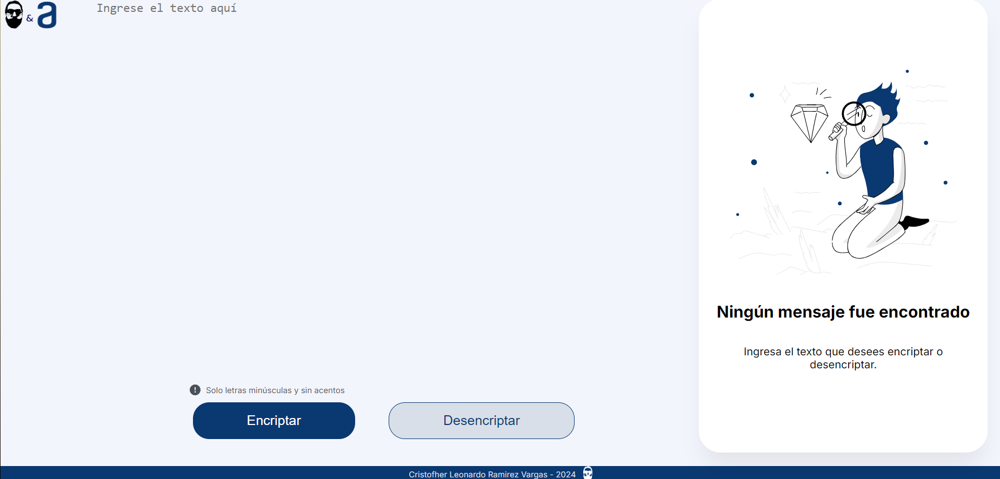
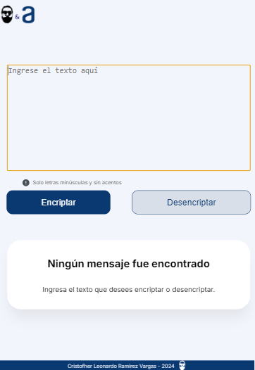
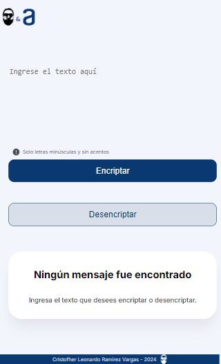

  

# Encriptador y Desencriptador - Reto G7 ONE - ALURA

Desarrollo del reto de ALURA, diseñado para poner a prueba y aplicar los conocimientos adquiridos durante el curso Oracle Next Education, perteneciente al grupo G7.

## Requisitos:

Las "llaves" de encriptación que utilizaremos son las siguientes:

_`La letra "a" es convertida para "ai"`_

_`La letra "e" es convertida para "enter"`_

_`La letra "i" es convertida para "imes"`_

_`La letra "o" es convertida para "ober"`_

_`La letra "u" es convertida para "ufat"`_

* Debe funcionar solo con letras minúsculas.

* No deben ser utilizados letras con acentos ni caracteres especiales.

* Debe ser posible convertir una palabra para la versión encriptada también devolver una palabra encriptada para su versión original.

**Nota**
_los siguientes caracteres son permiritos_

* ?
* ¿
* !
* ¡
* ,
* .
* ;
* :
* -

## Diseño 🚀

El diseño del aplicativo ha sido cuidadosamente desarrollado para garantizar una experiencia de usuario óptima y consistente en una amplia gama de dispositivos, incluyendo PCs, tablets y smartphones. Para lograrlo, se ha implementado un enfoque de diseño responsivo que ajusta automáticamente la interfaz y la disposición de los elementos en pantalla según el tamaño y la resolución del dispositivo utilizado.

**Visualización PC**

**Visualización Tablet's**

**Visualización SmartPhone**

### Instalación 🔧

* Abra Git Bash.

* Cambia el directorio de trabajo actual a la ubicación en donde quieres clonar el directorio.

* Escriba `git clone` y pegue la dirección URL del proyecto .

* git clone https://github.com/YOUR-USERNAME/YOUR-REPOSITORY

## Construido con 🛠️

* [HTML5](https://developer.mozilla.org/es/docs/Glossary/HTML5)
* [JavaScript](https://developer.mozilla.org/es/docs/Web/JavaScript)
* [CSS3](https://developer.mozilla.org/es/docs/Web/CSS/CSS_flexible_box_layout/Basic_concepts_of_flexbox)
* [VS CODE](https://code.visualstudio.com)

## Autor ✒️

* **Cristofher Leonardo Ramirez Vargas** - *Desarrollo y Documentación* - [yubfu](https://github.com/yubfu)

## Licencia 📄

Licencia por definir

## Expresiones de Gratitud 🎁

* ONE - Oracle Next Education 📢
* ALURA LATAM por la guía y el contenido del curso 🤓.

---
⌨️Desarrollado con ❤️ por [yubfu](https://github.com/yubfu) 😊